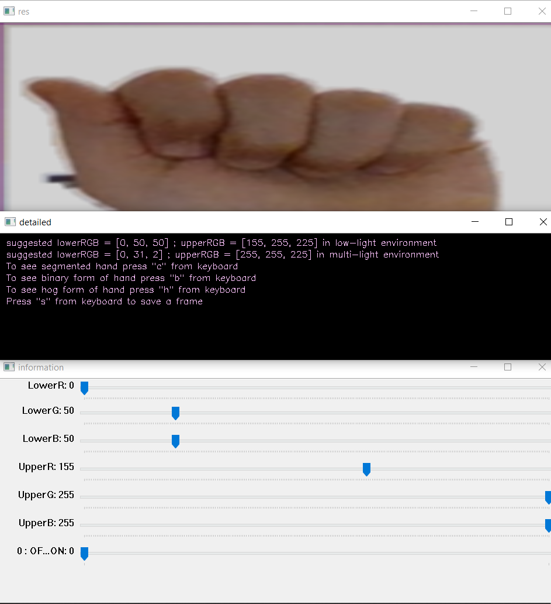

Data set Link : https://drive.google.com/drive/folders/1JibNxxc20FtJGesKrjrh9jrAL9B1aip_?usp=sharing  

In this study, we collect our own dataset and used 24 different gestures. Images are taken from 2 people and there are 1560 train data,
360 validation and 360 test data. We prefer to use pretrained VGG model as classifier. After we train the model, we come up with about 
%99 accuracy on test data.

    

  
The above picture shows the right part of the system. We display the segmented hand in res window, some information in detailed window and 
some controller in information window to control the upper and lower RGB values according to light in th environment. To change the 
lower and upper RGB values, the OF...ON should be switched to 1. 

Additionally, while system is running, 
  
* If "b" is pressed from keyboard, the binary segmented form of the frame is shown in the res window.
* If "c" is pressed from keyboard, the segmented form of the frame is shown in the res window(it is also default).     
* If "h" is pressed from keyboard, the the extracted features using hog of the frame is shown in the res window.
* If "s" is pressed from keyboard, the segmented form of the frame which is converted to grayscale is saved.

Medium blog:
https://medium.com/@aybukeyalcinerr/realtime-recognition-of-american-sign-language-alphabet-8ece006d424e?postPublishedType=repub

